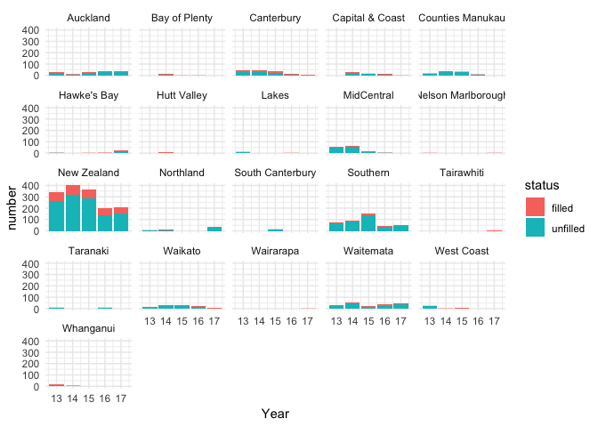

## Every perscription in New Zealand

Available from https://minhealthnz.shinyapps.io/datapharm-beta

Source: Ministry of Health's Pharmaceutical Collection, extracted on 30 May 2018.

This work is licensed under a Creative Commons Attribution 4.0 International License. For more information view the Ministry of Health's copyright statement.

Got to the data tab.

Click Download Full Dataset button

### Libraries used

Being R we are going to use some helper libraries


```r
library(readr)
library(dplyr)
library(knitr)
library(tidyr)
library(ggplot2)
```


### Read in the data

The data is presented by several different aggregation steps, as separate csv files:

* Data_ByChemForm.csv
* Data_ByChemical.csv
* Data_ByTG2.csv
* Data_ByTG3.csv
* PharmaceuticalsLookup.csv

To show so basic usage, I am using the ByChemcial by chemical, year, & DHB file.


```r
# read in the data
Data_ByChemical <- read_csv("fulldata/Data_ByChemical.csv")
```

```
## Parsed with column specification:
## cols(
##   Type = col_character(),
##   ChemID = col_double(),
##   Chemical = col_character(),
##   DHB = col_character(),
##   YearDisp = col_double(),
##   NumPharms = col_double(),
##   NumPpl = col_double(),
##   NHIComp = col_double()
## )
```

### Example one

Work out, as percentage of filled prescriptions, the most filled prescriptions/ the fewest unfilled prescriptions over the entire dataset.


```r
Data_ByChemical %>%
  filter(DHB != "New Zealand") %>%
  group_by(Chemical) %>%
  summarise(fillrate = (sum(NumPharms) - sum(NumPpl))/sum(NumPharms)) %>% arrange(desc(fillrate)) %>% slice(1:6) %>% kable()
```


Chemical                        fillrate
----------------------------  ----------
Methadone hydrochloride        0.9919862
Buprenorphine with naloxone    0.9918400
Anise water concentrate        0.9880240
Clozapine                      0.9606716
Procyclidine hydrochloride     0.9310763
Gabapentin (Neurontin)         0.9227468

### Example two

Work out, as percentage of filled prescriptions, the chemicals with the greatest variation in fill rates (for chemicals prescribed across 20 DHBs).


```r
Data_ByChemical %>%
  filter(DHB != "New Zealand") %>%
  group_by(Chemical, DHB) %>%
  summarise(fillrate = (sum(NumPharms) - sum(NumPpl))/sum(NumPharms)) %>% 
  group_by(Chemical) %>%
  summarise(regional_variation = sd(fillrate), n=n()) %>%
  filter(n > 19) %>%
  arrange(desc(regional_variation)) %>% slice(1:6) %>% kable()
```


Chemical                         regional_variation    n
------------------------------  -------------------  ---
Phenobarbitone sodium                     0.2872023   20
Caffeine citrate                          0.2812839   20
Lormetazepam                              0.2280192   20
Levomepromazine hydrochloride             0.2241382   20
Heparinised saline                        0.2200619   20
Busulfan                                  0.2167385   20

### Example three 

Graph the annual filled and unfilled prescriptions for Phenobarbitone sodium, the chemical with the greatest variation in fill rate between DHBs (for chemicals prescribed across 20 DHBs).


```r
Data_ByChemical %>%
  filter(Chemical == "Phenobarbitone sodium") %>%
  group_by(DHB, YearDisp) %>%
  summarise(unfilled = sum(NumPharms) - sum(NumPpl), filled=sum(NumPpl)) %>% 
  ungroup() %>%
  gather(status, number, unfilled:filled) %>%
  ggplot(aes(x=(YearDisp - 2000), y=number, fill=status)) + geom_col() + 
  facet_wrap(~ DHB) + theme_minimal() + xlab("Year")
```

<!-- -->


### R citations


```r
citation()
```

```
## 
## To cite R in publications use:
## 
##   R Core Team (2018). R: A language and environment for
##   statistical computing. R Foundation for Statistical Computing,
##   Vienna, Austria. URL https://www.R-project.org/.
## 
## A BibTeX entry for LaTeX users is
## 
##   @Manual{,
##     title = {R: A Language and Environment for Statistical Computing},
##     author = {{R Core Team}},
##     organization = {R Foundation for Statistical Computing},
##     address = {Vienna, Austria},
##     year = {2018},
##     url = {https://www.R-project.org/},
##   }
## 
## We have invested a lot of time and effort in creating R, please
## cite it when using it for data analysis. See also
## 'citation("pkgname")' for citing R packages.
```

```r
citation("readr")
```

```
## 
## To cite package 'readr' in publications use:
## 
##   Hadley Wickham, Jim Hester and Romain Francois (2018). readr:
##   Read Rectangular Text Data. R package version 1.3.1.
##   https://CRAN.R-project.org/package=readr
## 
## A BibTeX entry for LaTeX users is
## 
##   @Manual{,
##     title = {readr: Read Rectangular Text Data},
##     author = {Hadley Wickham and Jim Hester and Romain Francois},
##     year = {2018},
##     note = {R package version 1.3.1},
##     url = {https://CRAN.R-project.org/package=readr},
##   }
```

```r
citation("dplyr")
```

```
## 
## To cite package 'dplyr' in publications use:
## 
##   Hadley Wickham, Romain François, Lionel Henry and Kirill Müller
##   (2018). dplyr: A Grammar of Data Manipulation. R package version
##   0.7.8. https://CRAN.R-project.org/package=dplyr
## 
## A BibTeX entry for LaTeX users is
## 
##   @Manual{,
##     title = {dplyr: A Grammar of Data Manipulation},
##     author = {Hadley Wickham and Romain François and Lionel Henry and Kirill Müller},
##     year = {2018},
##     note = {R package version 0.7.8},
##     url = {https://CRAN.R-project.org/package=dplyr},
##   }
```

```r
citation("knitr")
```

```
## 
## To cite the 'knitr' package in publications use:
## 
##   Yihui Xie (2018). knitr: A General-Purpose Package for Dynamic
##   Report Generation in R. R package version 1.21.
## 
##   Yihui Xie (2015) Dynamic Documents with R and knitr. 2nd
##   edition. Chapman and Hall/CRC. ISBN 978-1498716963
## 
##   Yihui Xie (2014) knitr: A Comprehensive Tool for Reproducible
##   Research in R. In Victoria Stodden, Friedrich Leisch and Roger
##   D. Peng, editors, Implementing Reproducible Computational
##   Research. Chapman and Hall/CRC. ISBN 978-1466561595
## 
## To see these entries in BibTeX format, use 'print(<citation>,
## bibtex=TRUE)', 'toBibtex(.)', or set
## 'options(citation.bibtex.max=999)'.
```

```r
citation("tidyr")
```

```
## 
## To cite package 'tidyr' in publications use:
## 
##   Hadley Wickham and Lionel Henry (2018). tidyr: Easily Tidy Data
##   with 'spread()' and 'gather()' Functions. R package version
##   0.8.2. https://CRAN.R-project.org/package=tidyr
## 
## A BibTeX entry for LaTeX users is
## 
##   @Manual{,
##     title = {tidyr: Easily Tidy Data with 'spread()' and 'gather()' Functions},
##     author = {Hadley Wickham and Lionel Henry},
##     year = {2018},
##     note = {R package version 0.8.2},
##     url = {https://CRAN.R-project.org/package=tidyr},
##   }
```

```r
citation("ggplot2")
```

```
## 
## To cite ggplot2 in publications, please use:
## 
##   H. Wickham. ggplot2: Elegant Graphics for Data Analysis.
##   Springer-Verlag New York, 2016.
## 
## A BibTeX entry for LaTeX users is
## 
##   @Book{,
##     author = {Hadley Wickham},
##     title = {ggplot2: Elegant Graphics for Data Analysis},
##     publisher = {Springer-Verlag New York},
##     year = {2016},
##     isbn = {978-3-319-24277-4},
##     url = {http://ggplot2.org},
##   }
```

